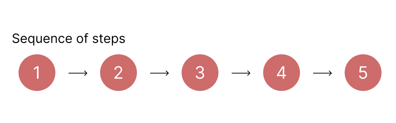
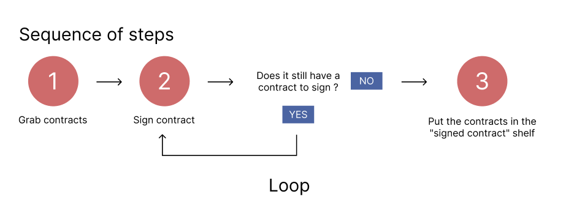
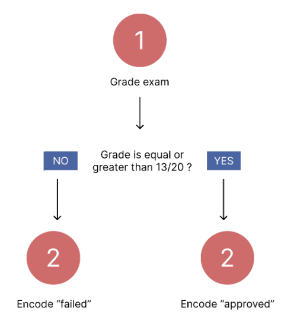
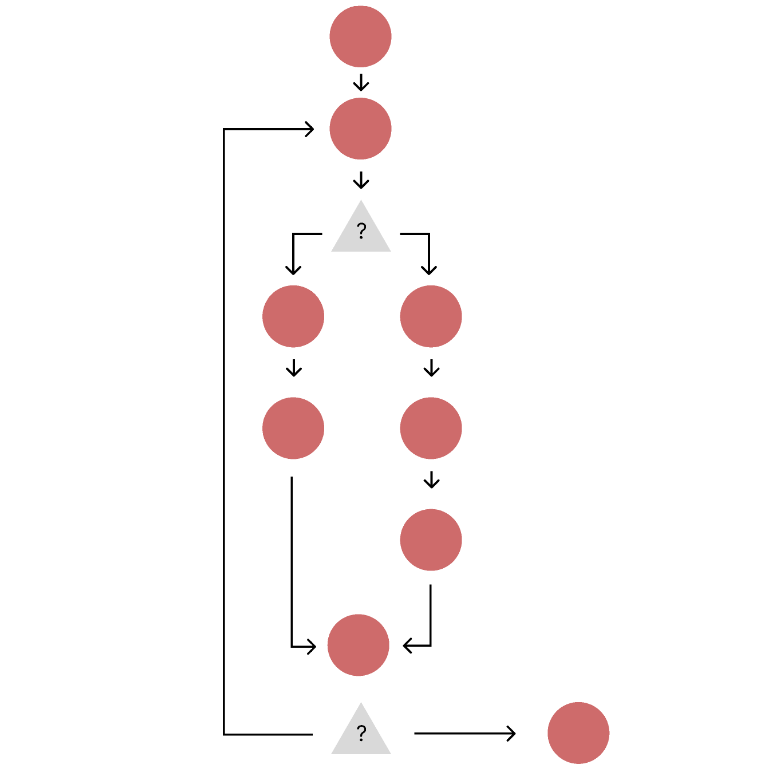

# What is an Algorithm?

---

**Algorithms are a sequence of steps to be followed in order to solve a problem.**

Think of a cooking recipe.

- Problem : I want to make a cake.
- Steps :
  - Gather ingredients
  - Preheat oven
  - Mix dry ingredients
  - Cream butter and sugar
  - Beat in eggs one at a time
  - Alternate dry and wet ingredients
  - Pour batter into pan
  - Bake until a toothpick inserted comes out clean

Let's reflect on it...
These steps have some characteristics...

- They must be done in a specific order (Some can be done in parallel, that's true... but usually you can only do one thing at the time) --> One leads to another.
- For each of these steps, we could break it into many other little steps. --> "_mix dry ingredients_" could be :
  - Take flour
  - Put it in a bowl
  - Take spoon
  - Mix it with the spoon..
  - etc.

This makes us realize :

**In order to solve a problem, we follow a step by step sequence of operations composed of several smaller problems.**

---

#### Repetition

Many times, in a step by step problem solution, we will need to perform the same thing some times.

Let's think of a veeeery simple step-by-step sequence : a manager in a company goes to his office and has to sign and send many contracts. Here is a possible sequence for that :

- Get to the office's kitchen
- Make a coffee
- Go to his office
- Grab all the contracts in a pile
  - Sign contract 1
  - Sign contract 2
  - Sign contract 3
  - etc.
- Put the contracts in the "signed contract" shelf.

Great... There is something quite interesting here... See that he has to sign several contracts ? Let's imagine he has a todo list for every step. Will he put in his todo list "Sign contract 1", then "Sign contract 2", etc. etc. ?

No ! He will just put "Sign all contracts" !

But there is a repetition here. So the next step will be in "hold" untill all the repetition is done. This is what we call a **loop**.

Here, the condition to stop signing contracts is when it's there is no more contract to be signed.

But we could also say : "Today, I am gonna sign 10 contracts only." (he'll do the rest tomorrow for example)

We can use loops to do this in these two different ways.

---

#### Conditional

We can also have **decision making**.

Let's think of another situtation :

A teacher is grading an exam and has to encode "approved" or "failed" in her computer.

This is a condition. Where the outcome might be different depending on some situation.

---

These logics will often be applied together and sometimes in very complex ways. Try to make sense of this image :

Can you answer to yourself where is the loop ? Where is the condition ? Did you realize that a loop answers to a condition as well ?

---

**Algorithms are not exclusive to software !** We use "algorithms" all the time in our day-to-day. In programming, we use this way of thinking and taking conscience of a problem with the tools the programming laguages give us to solve these problems.

---

#### Optimisation

The supreme goal for every problem solving is to make it optimized !

Let's think of this algorithm :

Problem : Dressing

1. Underwear
2. Socks
3. Shoes
4. Pants
5. Shirt

Is this optimized ? Nope ! Why not ? Think for yourself on why this is not optimized...

Open after completion

The answer is very simple : It will work, yes. The person will be dressed at the end. But dressing a pants after putting the shoes is not really smooth, is it ? It works, but it's not optimized.

**The sequence order matters !**

---

#### Input / Output

Every algorithm in programming will be using data and "behavior" (the action steps).

Generally speaking, we will always have some starting data and, after the whole steps, we will have the result data we want. This is called **input** and **output**

Just so you know :

- Some algorithms receive inputs but don't give any output
- Some algorithms don't receive inputs and give output anyway.
